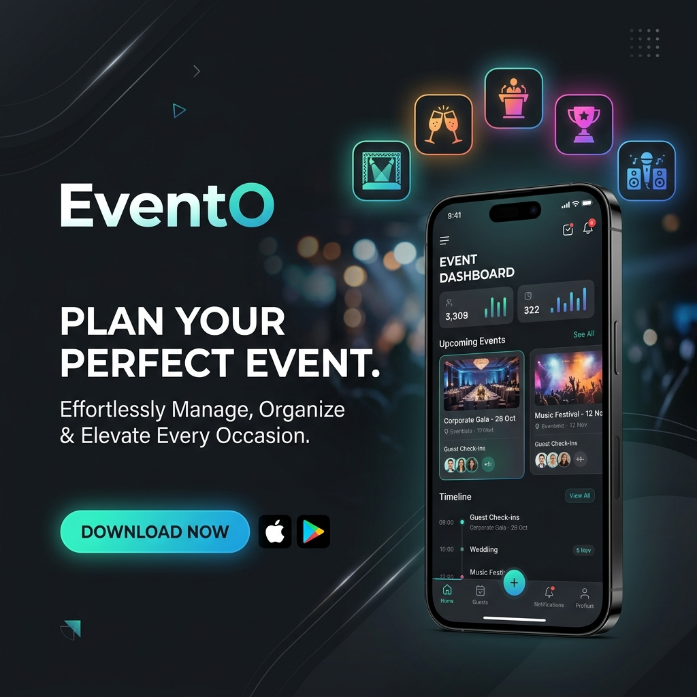

# EventO - Premium Event Management System



## Overview
EventO is a powerful Android application built with Java for seamless event management. It allows users to efficiently create, organize, and manage public and private events, featuring user registration, vendor lists, and integrated email communication tools.

## 🚀 Key Features
- **Comprehensive Event Logistics**: Create and manage events with detailed venues, dates, and expense tracking.
- **Privacy-First Approach**: Support for both **Public** and **Private** events, with secure password protection for private listings.
- **Vendor Management**: Browse and connect with a curated list of vendors (catering, decorators, etc.) directly within the app.
- **User Authentication**: Secure login and registration system for personalized event dashboards.
- **Real-time Communication**: Integrated email and SMS services for easy coordination.
- **Intuitive UI**: Modern navigation drawer for seamless access to all features (Create, View, Delete, and Vendor search).

## 🛠 Tech Stack
- **Languages**: [Java](https://www.java.com/) (JDK 1.8)
- **Framework**: [Android SDK](https://developer.android.com/) (Min SDK 24, Target SDK 34)
- **Networking**: [Volley](https://github.com/google/volley) (HTTP Request Library)
- **Design**: [Material Design](https://material.io/design)
- **Backend**: PHP / MySQL integration (via REST APIs)

## 📸 Screenshots
*(Coming Soon - Concept Mockup)*
> [!TIP]
> Use the side navigation drawer to quickly jump between managing your own events and exploring available vendors.

## 🏗 Installation & Setup
1. **Clone the repository**:
   ```bash
   git clone https://github.com/Amey241/EventO.git
   ```
2. **Open in Android Studio**:
   - File > Open > Select `EventO` directory.
3. **Configure Backend**:
   - Ensure you have a PHP server running locally with the necessary API scripts.
   - Update the `SERVER` URL in `app/src/main/java/com/example/evento/Keys.java` to match your server's IP address.
4. **Build and Run**:
   - Sync Gradle and run the app on an Emulator or physical device.

## 📄 License
This project is licensed under the MIT License - see the [LICENSE](LICENSE) file for details.

---
*Created with ❤️ by Amey241*
